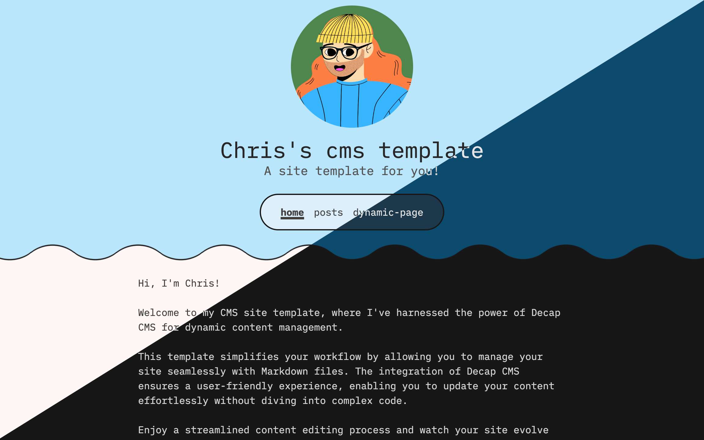

# Astro & Decap CMS Site

A basic CMS site with a minimal theme requiring no coding knowledge. All pages and posts are created via the admin UI and written in markdown.

## Features
- Create posts & pages via Admin UI
- Write content in markdown (also supports html)
- Light & dark theme
- Posts pagination
- View posts by tag (Coming soon)
- Search posts (Coming soon)

## Getting Started

### 1 - Deploy to netlify

### 2 - Set up Netlify Identity
  - `Site configuration --> Identity --> Enable Identity --> Enable Git Gateway ( In Services Section of Identity )`
  - You can allow Registration or Invite Only
  - For Invite Only: `Integrations --> Identity --> Invite Users --> Send invite email`

### 3 - Add an admin user
  - `Site configuration --> Identity --> Users --> Invite user`
  - You will need to verify email and set a password
    
### 4 - Navigate to your sites admin page
  - `www.your-site.com/admin`
   
### 5 - Login with the newly created admin account
 
## Tech stack

- [Astro](https://astro.build/) - Static Site Generator
- [Netlify](https://www.netlify.com/) - Hosting
- [Netlify Identity](https://www.netlify.com/products/identity/) - Authentication
- [Decap CMS](https://decapcms.org/) - CMS
- [TailwindCSS](https://tailwindcss.com/) - Styling

## How it works

- SSG on Netlify
- Decap CMS pushes changes to github
- Requires Netlify Identity (Can be manually replaced with other Oauth services)

  - Preview styles and templates won't be applied in dev server, but the cms will work
  - For actual use / local testing it's best to `pnpm run build && pnpm run preview`
  - If you are using windows you will need to edit the [package.json](./package.json)'s `dev` and `preview` commands to `"dev": "start decap-server & start astro dev"` and `"preview: "start decap-server & start astro preview"`

- Netlify Identity widget must be on root page ( is in `src/layouts/PageLayout.astro` but only needs to be on root page ) and `/admin`
- The decap admin board is preconfigured with preview styles built from the tailwind of our project and to only show the body in the preview ( personal preference of mine can be removed by removing the scripts in `/pages/admin.astro`)
- Tailwind typography for styling the blogs
  - Personally not a fan but I figured it was easy to use and remove

## Decap with oAuth Routes in Astro

https://github.com/OliverSpeir/astro-decap-starter-ssr
